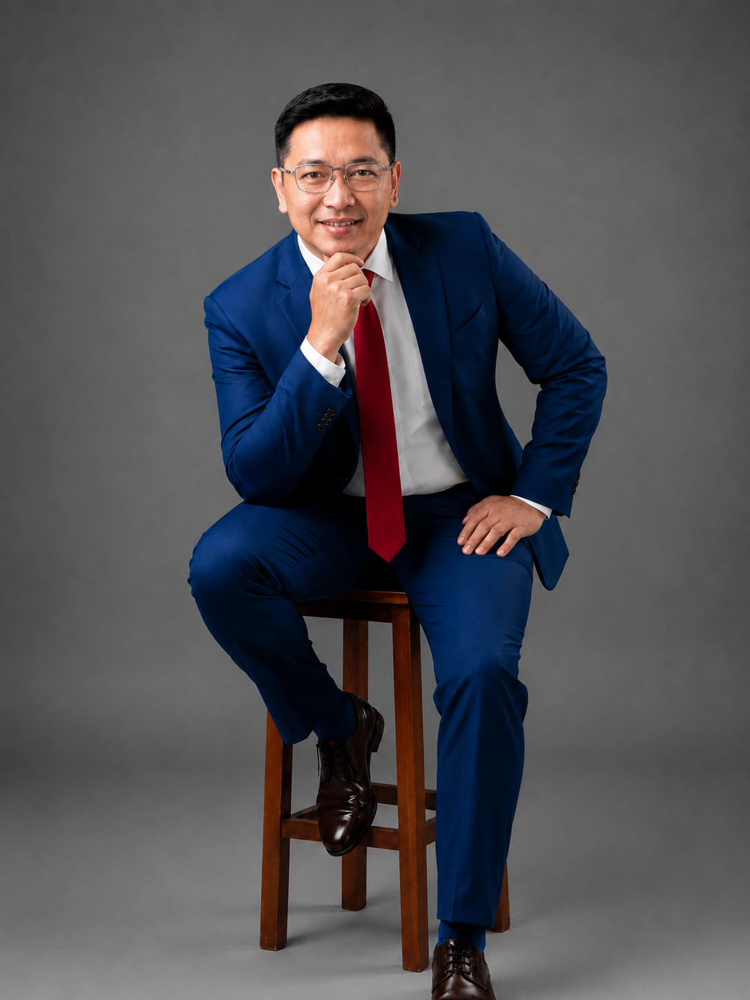

# Arnold L. Biliran — Portfolio

A single-page, responsive personal portfolio site built with vanilla HTML, CSS, and JavaScript — no frameworks, no build step. Showcases IT/database leadership experience, freelance creative services, published digital products, and content channels.

**Live site:** _add your deployed URL here (e.g. Netlify/GitHub Pages) once published_



---

## Features

- Fully responsive single-page layout (hero, about, experience timeline, services, digital products, content channels, certifications, contact)
- Smooth-scroll navigation and animated skill bars (`IntersectionObserver`)
- No external JS frameworks or build tools — works by opening `index.html` directly, or via any static host
- Organized, framework-free file structure for easy maintenance and version control

## Tech Stack

- **HTML5** — semantic single-page structure
- **CSS3** — custom properties (CSS variables), CSS Grid/Flexbox, no preprocessor
- **Vanilla JavaScript** — `IntersectionObserver` for skill-bar animation on scroll
- **Google Fonts** — Playfair Display (headings) + DM Sans (body)

## Project Structure

```
arnoldbiliran-portfolio/
│
├── index.html                 # Main page (structure/content only)
├── README.md                  # This file
├── LICENSE                    # MIT license
├── .gitignore
│
├── css/
│   └── style.css              # All site styling (extracted from inline <style>)
│
├── js/
│   └── script.js              # Scroll-triggered skill bar animation
│
├── assets/
│   ├── images/
│   │   ├── profile-hero.png   # Hero section photo
│   │   ├── profile-about.png  # About section photo
│   │   └── projects/          # Screenshots for individual project case studies
│   ├── icons/                 # Favicon / UI icons (add as needed)
│   └── fonts/                 # Local font files, if self-hosting fonts later
│
├── docs/
│   └── (place Arnold_Biliran_Resume.pdf here)
│
└── projects/                  # Optional deep-dive write-ups per project
    ├── pharmacy-inventory/    # Offline pharmacy inventory lookup tool
    ├── pharmacy-pos/          # Dr. A Pharma POS system (React/Node/Supabase)
    ├── business-tools/        # Misc. business/automation tools
    └── digital-products/      # eBooks, templates, affiliate site assets
```

> **Note:** the two profile photos were originally embedded as base64 inside the HTML `<style>`/`` tags. They've been extracted into `assets/images/` as real files — this cuts page weight significantly and makes the images individually cacheable and editable.

## Getting Started

No installation required.

**Option 1 — Open directly**
```bash
git clone https://github.com/<your-username>/arnoldbiliran-portfolio.git
cd arnoldbiliran-portfolio
open index.html      # macOS
# or just double-click index.html
```

**Option 2 — Local server (recommended, avoids any relative-path quirks)**
```bash
python3 -m http.server 8000
# then visit http://localhost:8000
```

## Deployment

This is a static site, so it deploys anywhere for free:

- **Netlify** — drag-and-drop the folder, or connect the GitHub repo for auto-deploys
- **GitHub Pages** — Settings → Pages → deploy from `main` branch, root folder
- **Vercel** — import the repo, no build command needed

## Customization

- **Colors/typography:** edit the CSS custom properties at the top of `css/style.css` (`:root { --navy, --gold, --cream, ... }`)
- **Content:** all copy lives directly in `index.html` — sections are commented (`<!-- ABOUT -->`, `<!-- EXPERIENCE -->`, etc.) for quick navigation
- **New project write-up:** drop a page/README inside the matching folder under `projects/` and link to it from the "Digital Products" or a new "Case Studies" section

## Roadmap

- [ ] Add resume PDF to `docs/`
- [ ] Add project screenshots to `assets/images/projects/`
- [ ] Write individual case-study pages for the pharmacy inventory tool and POS system
- [ ] Deploy and link live URL above

## License

Released under the [MIT License](LICENSE) — feel free to fork the structure for your own portfolio, but please don't reuse the personal content/photos.

## Contact

- Email: [abiliran@gmail.com](mailto:abiliran@gmail.com)
- YouTube: [@abiliran](https://www.youtube.com/@abiliran)
- Instagram: [@softmomliving](https://www.instagram.com/softmomliving/)

---
© 2026 Arnold L. Biliran · Davao City, Philippines
